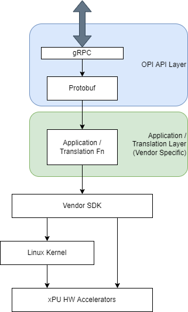

# OPI API and Behavioral Model Group

## Overview

OPI subgroup dealing with APIs.  The focus of the subgroup is:

- Define the object models for each of the components and services on the platform.
  - Define the layering of the capabilities that are abstracted
- Define both host system facing and control/management facing APIs
  - Discovery and Service Advertisement API
  - Capabilities/Capacity Advertisement API
    - Information such as Processor Cores available, Bandwidth, Memory, etc.
  - Configuration API
  - Consumption API for the data connections to the Host Compute
- Create a Taxonomy for services:
  - [Networking](network/README.md)
  - [Security](security/README.md)
  - [Storage](storage/README.md)
  - Gateway
  - Telemetry
  - [AI/ML](aiml/README.md)
  - others
- Define recommended industry APIs to be used.
  - For Example in Networking there are (OVS DB, OpenConfig, VPP, etc.)
- Identify gaps in APIs and recommend extensions for those capabilities
- Create/Define the Backend/Southbound facing interface APIs
- Produce protocol buffer (protobuf) definitions.
- Produce reference orchestration client to support testing of the API.

The API subgroup does not want to re-invent any industry standard APIs that already exist.  Standard APIs such as OVS DB, OpenConfig, VPP, etc. that are used for configuration of service capabilities will be reviewed and examined for gaps.  Gaps in capabilities will be addressed either by defining extensions to existing APIs or new APIs will need to be defined (such as Storage APIs).

## OPI API Boundary

The OPI API boundary for the configuration/control interface will end at the protobuf as shown in the diagram below.

The use of gRPC is the preferred mechanism for the config/control interface, with the protobuf containing the information to be used by the underlying shim.  This allows for implementations to provide:

- A mechanism where the gRPC can setup separate control flows for REST/OVS or other specific traffic mechanisms
- The use of an API Gateway that can
  - Utilize gRPC messages and deliver to the appropriate shim
  - Provide a gRPC to REST translation
  - Support gNMI and gNOI traffic over the gRPC
  

The OPI API boundary for the consumption interface will provide the exposed VF/PF capabilities to be used by the Host platform and/or the compute cores on the xPU.

---

- Leader
  - [Mark Sanders](https://github.com/sandersms)
- Meeting Time & Date
  - Thursdays 12:00-13:00 ET
- Slack Channel
  - [open-api-subgroup](https://opi-project.slack.com/archives/C0344KMEAKB)
- Status
  - Active
- Agenda
  - [Topics](Agenda.md)

## I Want To Contribute

This project welcomes contributions and suggestions.  We are happy to have the Community involved via submission of **Issues and Pull Requests** (with substantive content or even just fixes). We are hoping for the documents, test framework, etc. to become a community process with active engagement.  PRs can be reviewed by by any number of people, and a maintainer may accept.

See [CONTRIBUTING](https://github.com/opiproject/opi/blob/main/CONTRIBUTING.md) and [GitHub Basic Process](https://github.com/opiproject/opi/blob/main/doc-github-rules.md) for more details.
